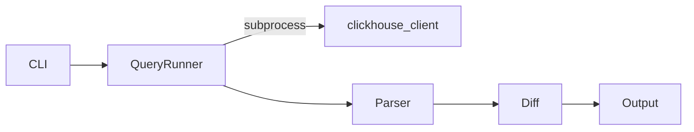
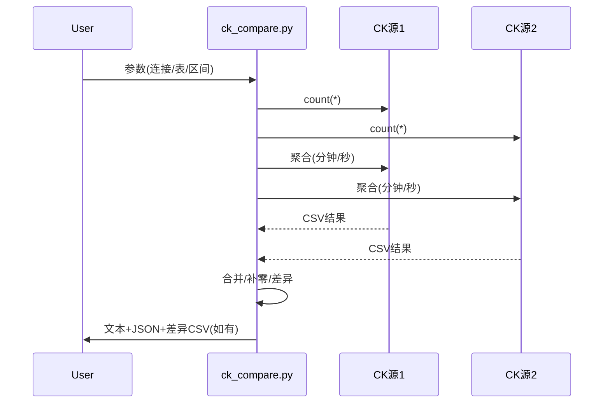

# DESIGN | ck_compare 数据量一致性校验脚本

本设计基于 ALIGNMENT 文档与最新澄清：
- 时间区间采用 `[start, end)`；时区以服务器时区为准。
- 表名传入为显式 `db.table`。
- 当存在差异时，按分钟生成差异 CSV（列：`metricTime(到分钟)`、源数据量、目标数据量）。
- 额外场景：若区间仅 1 分钟，则做“秒级”差异对比并输出秒级 CSV（列：`metricTime(到秒)`、源数据量、目标数据量）。

## 整体架构图
```mermaid
flowchart TD
    A[CLI 参数解析] --> B[输入校验与规范化]
    B --> C{区间长度}
    C -- >= 1 分钟 --> D[分钟级聚合查询 两端]
    C -- == 1 分钟 --> E[秒级聚合查询 两端]
    D --> F[Python合并两端桶/补零]
    E --> F[Python合并两端桶/补零]
    F --> G{是否存在差异}
    G -- 否 --> H[输出一致结论/JSON 摘要]
    G -- 是 --> I[生成差异CSV]
    I --> J[输出不一致结论/JSON 摘要/退出码2]
    H --> K[退出码0]
    J --> L[终端输出/日志]
    B --> M[总量 count(*) 查询 两端]
    M --> G
```

## 分层设计与核心组件
- CLI 层（单文件实现：`ck_compare.py`）
  - 解析两端连接参数、表名、时间区间、输出格式、可选 CSV 文件名、`clickhouse-client` 可执行路径。
  - 校验参数并规范化时间字符串（保持原样传入 SQL，采用 `[start, end)`）。

- 查询执行层
  - `run_query(conn, sql, format)`: 调用本机 `clickhouse-client` 执行 SQL，返回标准输出；错误时抛异常并带 stderr。
  - 总量查询：`SELECT count(*) FROM db.table WHERE metricTime >= parseDateTimeBestEffort('start') AND metricTime < parseDateTimeBestEffort('end')`。
-- 聚合查询：
    - 分钟级：`SELECT toStartOfInterval(metricTime, INTERVAL 1 MINUTE) AS bucket, count(*) AS cnt ... GROUP BY bucket ORDER BY bucket`。
    - 秒级（仅在区间等于1分钟时）：`SELECT toStartOfInterval(metricTime, INTERVAL 1 SECOND) AS bucket, count(*) AS cnt ... GROUP BY bucket ORDER BY bucket`。

- 结果处理层
  - 解析 CSVWithNames/CSV 输出为 `{bucket -> count}` 字典（两端分别）。
  - 统一桶集合（并集），缺失桶补零，计算差异集合。
  - 生成摘要 JSON 与人类可读文本。

- 输出层
  - 文本：打印两端总量、是否一致、差异条目数及示例。
  - JSON：`{"src_total":..., "dst_total":..., "equal":true/false, "diff_bucket_count":N}`。
  - 差异 CSV：
    - 区间>=1分钟：分钟精度；区间==1分钟：秒精度。
    - 列：`metricTime, src_count, dst_count`。
    - 默认文件名：`ck_diff_{table}_{granularity}_{start}_{end}.csv`，支持 `--csv-out` 自定义。

## 模块依赖关系图


## 接口契约定义
- `Connection`（结构体/字典）：`host, port, db, user, password, secure(bool), client_bin(str)`。
- `run_query(conn, sql, fmt='CSV') -> str`：
  - 成功：返回 stdout；失败：抛出异常（含返回码与 stderr）。
- `get_total(conn, table, start, end) -> int`
- `get_buckets(conn, table, start, end, granularity) -> Dict[str,int]`（`granularity in {'minute','second'}`）
- `diff_map(src:Dict, dst:Dict) -> List[Tuple[bucket, src_cnt, dst_cnt]]`
- `write_csv(rows, path) -> None`

## 数据流向图


## 异常处理策略
- `clickhouse-client` 未安装或不可执行：捕获 `FileNotFoundError`，打印提示并退出码 1。
- 连接/认证失败、SQL 错误：捕获非零返回码，打印 stderr 并退出码 1。
- 表或字段不存在：同上，明确错误信息指向 `db.table` 或 `metricTime`。
- 参数错误（空表名、区间非法）：打印错误并退出码 1。

## 关键实现约束
- 仅使用 Python 标准库：`argparse`、`subprocess`、`csv`、`json`、`datetime`、`pathlib`、`typing`。
- 所有查询通过 `clickhouse-client` 执行；不引入 Python clickhouse 驱动。
- 时间区间严格按照 `[start, end)` 构造 WHERE 条件；不做时区换算。
- 当区间长度恰为 60 秒（1 分钟）时，采用“秒级”聚合与差异输出。

## 校验准则
- 总量一致性：两端 `count(*)` 相等时返回码 0，否则 2。
- 差异明细：差异 CSV 仅包含有差异的桶；无差异时不生成或生成空文件（默认不生成）。
- 输出格式：支持 `text`、`json`、`both`；默认 `both`。

## 示例 SQL（示意）
```sql
-- 总量
SELECT count(*) AS cnt
FROM db.table
WHERE metricTime >= parseDateTimeBestEffort('{start}')
  AND metricTime <  parseDateTimeBestEffort('{end}');

-- 分钟级聚合
SELECT toStartOfInterval(metricTime, INTERVAL 1 MINUTE) AS bucket,
       count(*) AS cnt
FROM db.table
WHERE metricTime >= parseDateTimeBestEffort('{start}')
  AND metricTime <  parseDateTimeBestEffort('{end}')
GROUP BY bucket
ORDER BY bucket;

-- 秒级聚合（仅区间==1分钟时）
SELECT toStartOfInterval(metricTime, INTERVAL 1 SECOND) AS bucket,
       count(*) AS cnt
FROM db.table
WHERE metricTime >= parseDateTimeBestEffort('{start}')
  AND metricTime <  parseDateTimeBestEffort('{end}')
GROUP BY bucket
ORDER BY bucket;
```

## 下一步
- 若你确认设计与行为符合预期，我将据此实现 `ck_compare.py`（可直接执行、含函数级注释），并提供使用示例与验收说明。