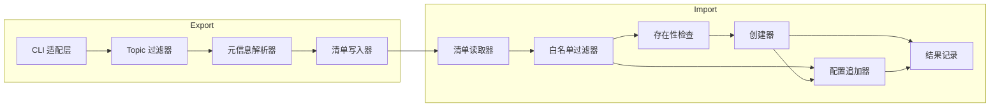
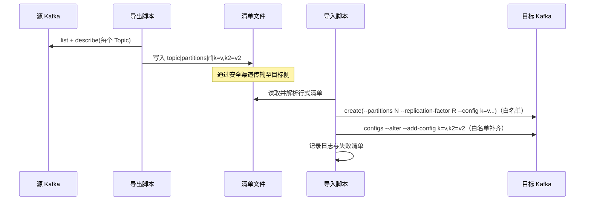

# DESIGN — kafka_topics_mirror

## 整体架构图
```mermaid
graph TD
  A[源 Kafka 2.6.1] -->|CLI: kafka-topics.sh --describe| B[导出脚本 export_kafka_topics.sh]
  B -->|生成行式清单 topics_manifest.lst| C[清单文件]
  C -->|安全传输(手动/自动)| D[导入脚本 import_kafka_topics.sh]
  D -->|CLI: kafka-topics.sh --create| E[目标 Kafka]
  D -->|CLI: kafka-configs.sh --alter (白名单)| E
  D --> F[执行日志/失败清单]
```

## 分层设计与核心组件
- 导出侧（源服务器）
  - CLI 适配层：封装 `kafka-topics.sh --list/--describe`，处理超时与错误。
  - Topic 过滤器：按正则与显式列表过滤内部/系统 Topic。
  - 元信息解析器：从 `--describe` 首行解析 `PartitionCount`、`ReplicationFactor`、`Configs:`。
  - 清单写入器：输出行式清单 `topic|partitions|rf|k=v,k2=v2`，第四段为空表示无显式配置。
- 导入侧（目标服务器）
  - 清单读取器：逐行解析为结构体，解析 `k=v` 集合。
  - 白名单过滤器：仅保留白名单键（不追加全部配置）。
  - 存在性检查：`--list` 确认 Topic 是否已存在；按策略跳过或创建。
  - 创建器：`--create --partitions N --replication-factor R [--config k=v...]`。
  - 配置追加器：`kafka-configs.sh --alter --add-config k=v,k2=v2`（仅对白名单键）。
  - 结果记录：生成执行日志与失败清单，便于复查与重试。

## 模块依赖关系图


## 接口契约定义
- 行式清单（导出侧产出，导入侧消费）
  - 行格式：`<topic>|<partitions>|<rf>|<k=v,k2=v2>`
  - 字段含义：
    - `topic`: 主题名（原样）
    - `partitions`: 分区数（整数）
    - `rf`: 复制因子（整数）
    - `k=v,k2=v2`: 逗号分隔的显式配置集合；为空表示无显式配置
  - 约束：导入侧只按白名单键进行应用；不写默认值、不覆盖非白名单键。

- 导出脚本 `export_kafka_topics.sh`（在源服务器执行）
  - 输入参数：
    - `--src <HOST:PORT>`：源集群 `--bootstrap-server`
    - `--bin <PATH>`：Kafka `bin` 目录（含 `kafka-topics.sh`），默认读取脚本头部变量 `KAFKA_BIN_DIR`
    - `--exclude-regex <REGEX>`：内部 Topic 正则，默认 `^(__|_).*`
    - `--exclude-list <CSV>`：显式排除列表（默认含常见系统 Topic）
    - `--out <FILE>`：输出清单文件路径（默认 `./topics_manifest.lst`）
    - `--dry-run`：仅打印将收集的 Topic 与解析结果
  - 输出契约：生成 `topics_manifest.lst`；若 `--dry-run` 则只输出预览
  - 错误策略：
    - CLI 不可用/连接失败：退出并记录错误
    - 解析失败：记录并跳过该 Topic（汇总到失败清单）

- 导入脚本 `import_kafka_topics.sh`（在目标服务器执行）
  - 输入参数：
    - `--dest <HOST:PORT>`：目标集群 `--bootstrap-server`
    - `--bin <PATH>`：Kafka `bin` 目录（含 `kafka-topics.sh`、`kafka-configs.sh`），默认读取脚本头部变量 `KAFKA_BIN_DIR`
    - `--manifest <FILE>`：清单文件路径（行式）
    - `--skip-existing`：目标存在则跳过创建（默认开启，按共识）
    - `--rf-cap <N>`：复制因子上限；不设置则不降级（按共识默认不启用）
    - `--config-whitelist <CSV>`：白名单键集合，仅这些键会被应用（例如 `cleanup.policy,min.insync.replicas,retention.ms`）
    - `--dry-run`：仅输出将执行的创建与配置追加命令
  - 行为契约：
    - 仅处理清单中 Topic 的创建；已存在统一跳过，不更新配置
    - 创建阶段尽量通过 `--config` 传入白名单键；若失败或部分键不生效，使用 `kafka-configs.sh --alter` 追加
  - 错误策略：
    - 创建失败：记录失败项（Topic、原因、建议）并继续处理其他条目
    - 配置追加失败：跳过并记录（可能为只读或不兼容键）

## 数据流向图


## 异常处理策略
- CLI 兼容与可用性：检查 `kafka-topics.sh`/`kafka-configs.sh` 是否存在且可执行；连接连通性检查（`--bootstrap-server`）。
- 解析健壮性：兼容 2.6.1 的 `--describe` 输出格式；解析不到 `PartitionCount`/`ReplicationFactor` 则记录失败。
- 白名单控制：导入时仅应用白名单键；默认需显式传入，避免误改（与共识一致）。
- 并发与速率：串行执行；确保稳定性与日志可读性。
- 失败重试：支持根据失败清单重新执行（后续可扩展重试策略）。

## 设计可行性验证
- 依赖工具：仅需 Kafka 官方 CLI 与常规 Bash 工具；2.6.1 版本 `--bootstrap-server` 可用。
- 权限与网络：两脚本分别在源/目标服务器执行；通过文件传输弥合网络隔离。
- 幂等性：`--skip-existing` 保证重复执行不破坏；不对已存在 Topic 进行配置更新（按共识）。

## 备注与实现约束
- 脚本函数需包含函数级注释（中英文均可），说明输入/输出/返回值与边界。
- 默认不设置 `rf-cap`；如目标集群 broker 数不足导致创建失败，记录失败并继续。
- 白名单样例：`cleanup.policy,min.insync.replicas`（是否包含 `retention.ms` 由你决定，在执行时以参数传入）。