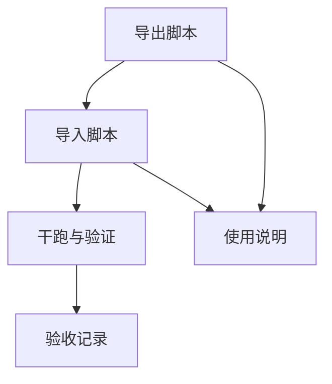

# TASK — kafka_topics_mirror

## 全局约束与假设
- Kafka 版本：源/目标为 2.6.1，使用 `--bootstrap-server` 模式。
- 执行环境：Linux，脚本为 Bash；`kafka-topics.sh`/`kafka-configs.sh` 来自 `KAFKA_BIN_DIR`（脚本头部变量，可通过参数覆盖）。
- 网络隔离：导出与导入在不同服务器执行，通过离线清单文件对接。
- 并发策略：串行执行（不并发）。
- 配置同步：仅追加“白名单”配置键；不追加全部配置（例如不自动追加 `retention.ms` 等），白名单通过参数传入。
- 复制因子策略：默认不设置 `rf-cap`。若目标 broker 数不足导致创建失败，记录失败并继续处理其他 Topic。

## 原子任务列表

### T1. 实现导出脚本 `export_kafka_topics.sh`
- 输入契约：
  - `--src <HOST:PORT>`：源 Kafka `--bootstrap-server`。
  - `--bin <PATH>`：Kafka `bin` 目录，默认读取脚本头部 `KAFKA_BIN_DIR`。
  - `--exclude-regex <REGEX>`：内部/系统 Topic 正则，默认 `^(__|_).*`。
  - `--exclude-list <CSV>`：显式排除列表（默认包含常见系统 Topic）。
  - `--out <FILE>`：输出清单文件路径（默认 `./topics_manifest.lst`）。
  - `--dry-run`：仅打印将收集的 Topic 与解析结果。
- 输出契约：
  - 产出行式清单文件：`<topic>|<partitions>|<rf>|<k=v,k2=v2>`；若无显式配置第四段为空。
  - 生成日志 `export.log` 与失败清单 `export_failed.lst`（解析失败或 CLI 异常）。
- 实现约束：
  - 使用 `kafka-topics.sh --list/--describe`，解析 `PartitionCount`、`ReplicationFactor`、`Configs:`（首行）。
  - 仅采集显式配置（来自 `Configs:`），不写默认值。
  - 函数级注释说明输入/输出/返回与异常处理。
- 依赖关系：无前置依赖。
- 验收标准：
  - 清单格式正确，字段完整；内部/系统 Topic 被正确过滤。
  - `--dry-run` 输出包含即将写入的条目与解析的配置集合。

### T2. 实现导入脚本 `import_kafka_topics.sh`
- 输入契约：
  - `--dest <HOST:PORT>`：目标 Kafka `--bootstrap-server`。
  - `--bin <PATH>`：Kafka `bin` 目录，默认脚本头部 `KAFKA_BIN_DIR`。
  - `--manifest <FILE>`：行式清单文件路径（由 T1 产生或手动提供）。
  - `--skip-existing`：已存在 Topic 跳过创建（默认开启，按共识）。
  - `--rf-cap <N>`：复制因子上限（默认不启用）。
  - `--config-whitelist <CSV>`：白名单配置键集合，仅这些键会被应用（例如 `cleanup.policy,min.insync.replicas`）。
  - `--dry-run`：仅输出将执行的命令。
- 输出契约：
  - 创建 Topic 的执行日志 `import.log` 与失败清单 `import_failed.lst`。
- 实现约束：
  - 仅处理清单中的 Topic；已存在统一跳过，不更新配置。
  - 创建阶段通过多个 `--config k=v` 传入白名单键；必要时用 `kafka-configs.sh --alter --add-config k=v,k2=v2` 补齐白名单键。
  - 不应用非白名单键；只读/不兼容键跳过并记录。
  - 函数级注释说明输入/输出/返回与异常处理。
- 依赖关系：
  - 依赖 T1 的清单文件（或同格式手工清单）。
- 验收标准：
  - 对不存在的 Topic 成功创建，分区与复制因子与清单一致（或遵守 `rf-cap`）。
  - 仅对白名单键执行配置应用；`--dry-run` 输出包含完整命令预览。

### T3. 编写使用说明 `README_kafka_topics_mirror.md`
- 输入契约：采纳 ALIGNMENT/CONSENSUS/DESIGN 文档内容与脚本参数。
- 输出契约：
  - 使用步骤、参数说明、白名单示例、常见问题与失败清单解释。
- 实现约束：不包含敏感信息；示例使用 `--dry-run` 与行式清单样例。
- 依赖关系：
  - 依赖 T1/T2 的参数与行为稳定。
- 验收标准：
  - 按文档即可独立执行导出/导入流程。

### T4. 干跑与验证（不联网本地验证）
- 输入契约：
  - 人工或 T1 生成的样例清单（包含若干 Topic 及配置键，如 `cleanup.policy`）。
  - 导入端执行 `--dry-run`。
- 输出契约：
  - 干跑日志与验证报告，确认创建命令与配置追加命令正确生成、仅包含白名单键。
- 实现约束：不实际连接 Kafka；仅验证解析与命令构造正确性。
- 依赖关系：
  - 依赖 T2（命令构造逻辑）。
- 验收标准：
  - 干跑输出符合预期；白名单控制生效；不存在非白名单键被应用。

### T5. 更新验收记录 `ACCEPTANCE_kafka_topics_mirror.md`
- 输入契约：T1/T2/T4 的执行结果。
- 输出契约：
  - 记录对齐的验收项、通过与失败的条目、后续改进点。
- 实现约束：与 CONSENSUS 验收标准一致；保留失败清单引用。
- 依赖关系：
  - 依赖 T4 完成干跑验证。
- 验收标准：
  - 验收文档完整且可追溯；结论明确。

## 任务依赖图

## 执行顺序（建议）
1. T1 导出脚本
2. T2 导入脚本
3. T4 干跑与验证（确保白名单与命令构造正确）
4. T3 使用说明
5. T5 验收记录

## 质量与实现约束（统一）
- 代码风格：Bash，函数级注释；输入校验与错误处理完备。
- 工具依赖：Kafka 官方 CLI 与常规 Bash 工具（`timeout`、`grep`、`awk`、`sed`）。不依赖 `jq`。
- 安全：不写入敏感信息；Kafka 认证交由环境/CLI。
- 幂等性：`--skip-existing` 默认开启；不对已存在 Topic 执行配置更新（按共识）。
- 白名单：必须通过 `--config-whitelist <CSV>` 传入；不提供则不应用任何配置键。

## 验收测试计划（优先）
- 单元级（脚本层）：
  - 解析 `--describe` 首行（包含/不包含 Configs）
  - 清单行解析（含空第四段）
  - 白名单过滤（只保留白名单键）
- 集成级（干跑）：
  - 根据清单生成创建命令与配置追加命令，仅包含白名单键
  - 已存在 Topic 跳过逻辑验证（通过模拟 `--list` 输出）
  - `rf-cap` 未设置时的行为（不降级，记录失败）

## 备注
- 白名单示例（可在执行时传入）：`cleanup.policy,min.insync.replicas`（示例不包含 `retention.ms`）。
- 若未来需要覆盖已存在 Topic 的配置，可新增命令开关；当前按共识默认关闭。