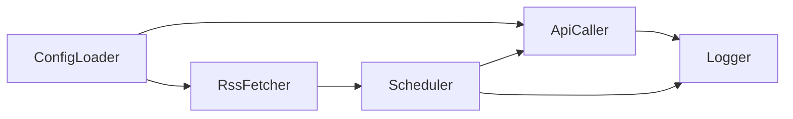
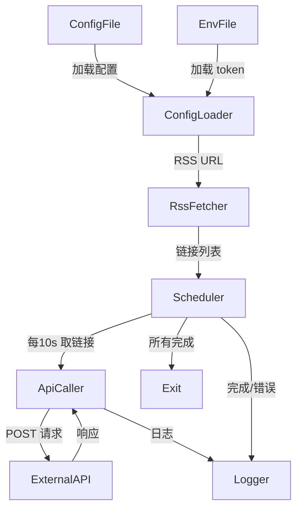

# DESIGN_rss_note_writer

基于 CONSENSUS_rss_note_writer.md 和 ALIGNMENT_rss_note_writer.md，以下是系统架构设计文档。设计严格限定在任务范围内，避免过度复杂化，与现有项目（Python 脚本导向）保持一致，复用标准库和简单模式。

## 整体架构图
```mermaid
graph TD
    A[配置文件 (.json/.yaml)] --> B[配置加载模块]
    B --> C[RSS 获取模块]
    C --> D[链接队列]
    D --> E[定时调用模块 (每10s)]
    E --> F[API 调用模块]
    F --> G[外部 API]
    E --> H[日志记录模块]
    subgraph "脚本边界"
        B
        C
        D
        E
        F
        H
    end
    I[.env (token)] --> F
```

## 分层设计和核心组件
- **配置层**：加载 RSS 配置（RSS URL、topic_id、topic_directory_id），使用 JSON 文件存储多个配置。
- **数据采集层**：RSS 获取模块，使用 feedparser 解析 RSS feed，提取链接（最多10个 per 配置）。
- **调度层**：定时模块，使用 time.sleep 或 schedule 实现每10s 调用，处理链接队列，切换配置。
- **集成层**：API 调用模块，使用 requests 发送 POST 请求，动态生成 headers 和 payload。
- **支持层**：日志记录（使用 logging），异常处理，.env 管理 token。

核心组件：
- ConfigLoader：加载配置和 .env。
- RssFetcher：解析 RSS，构建链接列表。
- ApiCaller：构造请求，发送 API 调用。
- Scheduler：管理定时循环和配置切换。

## 模块依赖关系图


## 接口契约定义
- **内部接口**：
  - ConfigLoader.load() → List[Dict] (返回 RSS 配置列表)。
  - RssFetcher.fetch_links(rss_url: str, max_links: int = 10) → List[str] (返回链接列表)。
  - ApiCaller.call_api(link: str, topic_id: str, topic_dir_id: str) → Response (发送 POST，返回响应)。
  - Scheduler.run(configs: List[Dict]) → None (运行循环，处理所有配置)。

- **外部接口**：
  - RSS Feed：标准 RSS XML 接口。
  - API：POST /voicenotes/web/topics/notes/stream，输入 JSON payload，返回标准 HTTP 响应。

## 数据流向图


## 异常处理策略
- **RSS 解析失败**：日志错误，跳过当前配置，切换下一个。
- **API 调用失败**（e.g., 4xx/5xx）：日志响应，跳过当前链接，继续下一个（无重试，以避免率限）。
- **配置无效**：启动时验证，日志并退出。
- **链接耗尽**：切换配置；所有完成时，打印“所有 RSS 配置同步完成”并退出。
- **通用**：使用 try-except 捕获，日志详细信息，不崩溃脚本。

## 设计原则验证
- 严格任务范围：仅处理 RSS 获取、有限次 API 调用、配置切换。
- 与现有架构一致：简单 Python 脚本，无框架依赖，类似 ck_compare.py。
- 复用：使用标准库 (time, logging) 和常见包 (feedparser, requests, python-dotenv)。

## 质量门控
- 架构图清晰准确：是。
- 接口定义完整：是。
- 与现有系统无冲突：是（独立脚本）。
- 设计可行性验证：是（基于 Python 标准实践，可快速实现）。