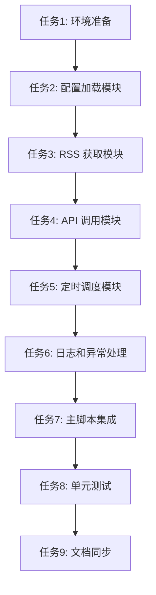

# TASK_rss_note_writer

基于 DESIGN_rss_note_writer.md 和 CONSENSUS_rss_note_writer.md，以下是原子化任务拆分。每个任务独立可验证，依赖关系清晰，复杂度可控。

## 任务依赖图

## 原子任务列表

### 任务1: 环境准备
- **输入契约**：
  - 前置依赖：无。
  - 输入数据：无。
  - 环境依赖：Python 3.x，pip 可用。
- **输出契约**：
  - 输出数据：requirements.txt 文件。
  - 交付物：requirements.txt，包含 feedparser、requests、python-dotenv。
  - 验收标准：文件创建，依赖列表正确，可 pip install -r requirements.txt 安装。
- **实现约束**：
  - 技术栈：Python 包管理。
  - 接口规范：无。
  - 质量要求：依赖版本明确（如 feedparser>=6.0.0）。
- **依赖关系**：后置任务 2。

### 任务2: 配置加载模块
- **输入契约**：
  - 前置依赖：任务1 完成。
  - 输入数据：config/rss_configs.json（示例）和 .env（包含 BEARER_TOKEN）。
  - 环境依赖：python-dotenv 已安装。
- **输出契约**：
  - 输出数据：加载的 RSS 配置列表（List[Dict]），token 字符串。
  - 交付物：config_loader.py，包含 ConfigLoader 类，方法 load_configs() 和 load_token()。
  - 验收标准：
    - 能正确解析 JSON 配置（每个条目有 rss_url、topic_id、topic_directory_id）。
    - 从 .env 加载 BEARER_TOKEN。
    - 验证配置存在，否则抛出清晰错误。
- **实现约束**：
  - 技术栈：Python，json，dotenv。
  - 接口规范：ConfigLoader.load_configs() → List[Dict]，load_token() → str。
  - 质量要求：错误处理明确，日志记录加载状态。
- **依赖关系**：后置任务 3。

### 任务3: RSS 获取模块
- **输入契约**：
  - 前置依赖：任务2 完成。
  - 输入数据：RSS URL 字符串，max_links（默认10）。
  - 环境依赖：feedparser 已安装。
- **输出契约**：
  - 输出数据：链接列表（List[str]）。
  - 交付物：rss_fetcher.py，包含 RssFetcher 类，方法 fetch_links(rss_url: str, max_links: int = 10) → List[str]。
  - 验收标准**：
    - 使用 feedparser.parse 获取 RSS。
    - 提取 entry.link，最多 max_links 个。
    - 处理 RSS 无效或无链接：返回空列表，日志警告。
- **实现约束**：
  - 技术栈：feedparser。
  - 接口规范：fetch_links 返回链接列表。
  - 质量要求：不崩溃，边界测试（空 RSS、无 entry.link）。
- **依赖关系**：后置任务 4。

### 任务4: API 调用模块
- **输入契约**：
  - 前置依赖：任务3 完成。
  - 输入数据：link 字符串，topic_id 字符串，topic_directory_id 字符串，token 字符串。
  - 环境依赖：requests 已安装。
- **输出契约**：
  - 输出数据：requests.Response 对象。
  - 交付物：api_caller.py，包含 ApiCaller 类，方法 call_api(link, topic_id, topic_dir_id, token) → Response。
  - 验收标准**：
    - 构造 payload：{"attachments":[{"size":100,"type":"link","url":link}],"content":"","entry_type":"ai","note_type":"link","source":"web","topic_id":topic_id,"topic_directory_id":topic_dir_id}。
    - 构造 headers：包括动态 X-Request-ID（int(time.time()*1000)）、Authorization Bearer token、User-Agent 等（匹配示例）。
    - 发送 POST 到 https://get-notes.luojilab.com/voicenotes/web/topics/notes/stream。
    - 返回响应，日志请求状态。
- **实现约束**：
  - 技术栈：requests。
  - 接口规范：call_api 返回 Response。
  - 质量要求：异常捕获（requests 错误），日志记录。
- **依赖关系**：后置任务 5。

### 任务5: 定时调度模块
- **输入契约**：
  - 前置依赖：任务4 完成。
  - 输入数据：RSS 配置列表（List[Dict]），token 字符串。
  - 环境依赖：time 模块。
- **输出契约**：
  - 输出数据：无（副作用：API 调用）。
  - 交付物：scheduler.py，包含 Scheduler 类，方法 run(configs, token) → None。
  - 验收标准**：
    - 遍历 configs，对每个：
      - 调用 RssFetcher.fetch_links 获取链接。
      - 如果链接为空，跳过。
      - 对每个链接，最多写入 10 次？（澄清：每个链接最多写入 10 次，但逻辑上可能是每个 RSS 源最多处理 10 个链接）。
      - 每 10 秒调用一次 ApiCaller.call_api，写入一个链接。
      - 链接耗尽或达到上限，切换下一个配置。
    - 所有配置处理完成，打印“所有 RSS 配置同步完成”并退出。
- **实现约束**：
  - 技术栈：Python time.sleep(10)。
  - 接口规范：run 方法无返回。
  - 质量要求：循环逻辑正确，不无限运行，日志清晰。
- **依赖关系**：后置任务 6。

### 任务6: 日志和异常处理
- **输入契约**：
  - 前置依赖：任务5 完成。
  - 输入数据：无。
  - 环境依赖：logging 模块。
- **输出契约**：
  - 输出数据：日志文件（可选）和控制台输出。
  - 交付物：logger.py 或集成到各模块，设置 logging.basicConfig，级别 INFO。
  - 验收标准**：
    - 所有模块使用 logging.info/warning/error 记录关键步骤（配置加载、RSS 获取、API 调用、完成）。
    - 异常处理：各模块 try-except，日志错误，不崩溃。
- **实现约束**：
  - 技术栈：logging。
  - 接口规范：标准 logging。
  - 质量要求：日志可读，错误信息明确。
- **依赖关系**：后置任务 7。

### 任务7: 主脚本集成
- **输入契约**：
  - 前置依赖：任务6 完成。
  - 输入数据：无（命令行运行）。
  - 环境依赖：所有模块已就绪。
- **输出契约**：
  - 输出数据：执行日志。
  - 交付物：rss_note_writer.py（主脚本），放置在 scripts/ 下。
  - 验收标准**：
    - 脚本可运行：python scripts/rss_note_writer.py。
    - 流程：加载配置和 token → 运行调度 → 完成退出。
    - 包含 __main__ 保护。
- **实现约束**：
  - 技术栈：Python 脚本。
  - 接口规范：命令行入口。
  - 质量要求：可执行，日志清晰。
- **依赖关系**：后置任务 8。

### 任务8: 单元测试
- **输入契约**：
  - 前置依赖：任务7 完成。
  - 输入数据：测试用例定义。
  - 环境依赖：pytest 或 unittest。
- **输出契约**：
  - 输出数据：测试报告。
  - 交付物：tests/ 文件夹，包含 test_config_loader.py、test_rss_fetcher.py、test_api_caller.py、test_scheduler.py。
  - 验收标准**：
    - 覆盖关键模块：配置加载（有效/无效）、RSS 获取（有效/无效 RSS）、API 调用（mock 响应）、调度逻辑（mock 获取和调用）。
    - 所有测试通过。
- **实现约束**：
  - 技术栈：pytest。
  - 接口规范：测试函数命名 test_。
  - 质量要求：边界条件、异常路径覆盖。
- **依赖关系**：后置任务 9。

### 任务9: 文档同步
- **输入契约**：
  - 前置依赖：任务8 完成。
  - 输入数据：代码变更。
  - 环境依赖：无。
- **输出契约**：
  - 输出数据：更新的文档。
  - 交付物：ACCEPTANCE_rss_note_writer.md（记录完成情况），README.md（可选，使用说明）。
  - 验收标准**：
    - ACCEPTANCE 文档记录每个任务完成状态。
    - README 包含运行步骤：安装依赖、配置 .env 和 config、运行脚本。
- **实现约束**：
  - 技术栈：Markdown。
  - 接口规范：无。
  - 质量要求：文档与代码同步，准确。
- **依赖关系**：无后置（最终任务）。

## 拆分原则验证
- 复杂度可控：每个任务单一职责，便于 AI 高成功率交付。
- 功能模块分解：按架构分层拆分。
- 独立验证：每个任务有明确验收标准。
- 依赖关系清晰：无循环，顺序执行。

## 质量门控
- 任务覆盖完整需求：是（RSS 获取、API 调用、定时、配置、测试、文档）。
- 依赖关系无循环：是。
- 每个任务可独立验证：是。
- 复杂度评估合理：是（中等复杂度，分步实现）。